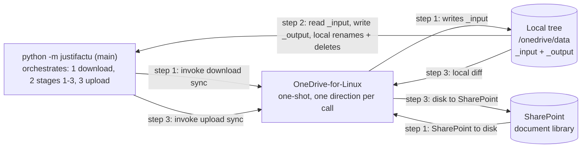
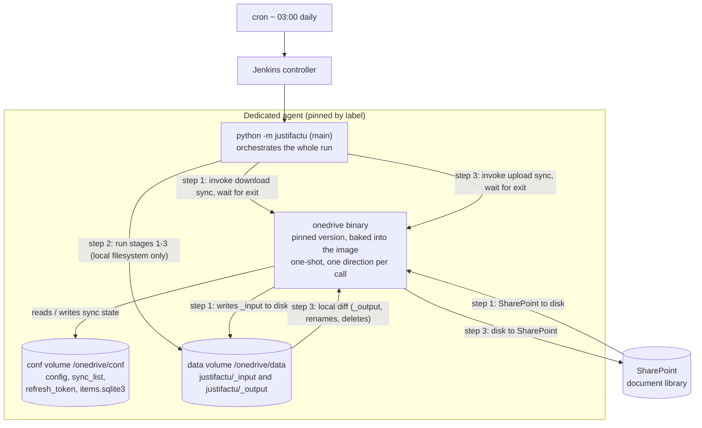
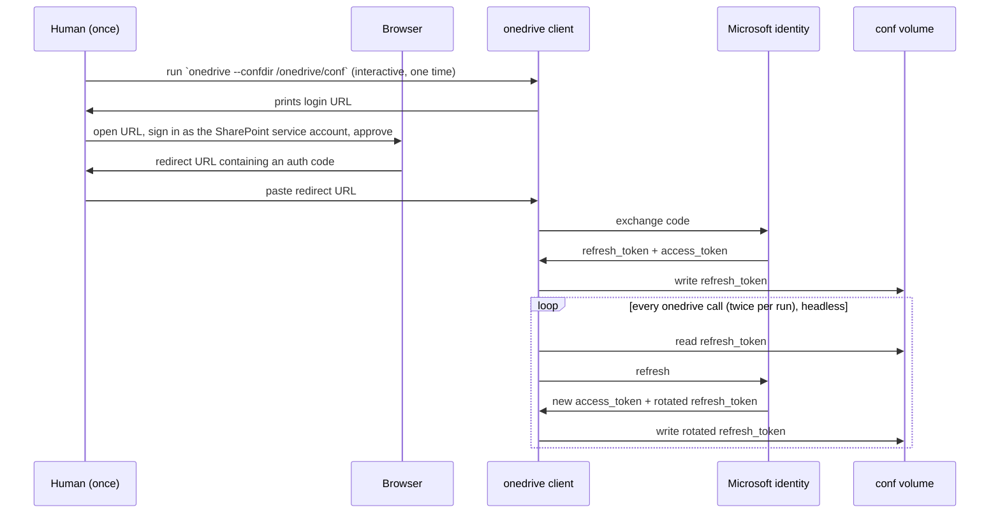
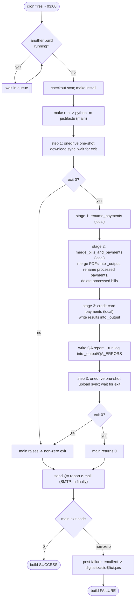

# Justifactu — OneDrive sync strategy and pipeline orchestration

## Contents

1. [Purpose and scope](#1-purpose-and-scope)
2. [Background: one channel to SharePoint](#2-background-one-channel-to-sharepoint)
3. [Problem statement](#3-problem-statement)
4. [Constraints that shape the design](#4-constraints-that-shape-the-design)
5. [Why not keep the docker-compose sidecar](#5-why-not-keep-the-docker-compose-sidecar)
6. [Chosen design](#6-chosen-design)
7. [Execution schema (one pipeline run)](#7-execution-schema-one-pipeline-run)
8. [What has to be built (migration checklist)](#8-what-has-to-be-built-migration-checklist)
9. [Failure modes and recovery runbook](#9-failure-modes-and-recovery-runbook)
10. [Operational monitoring](#10-operational-monitoring)
11. [Decision log](#11-decision-log)
12. [Glossary](#12-glossary)
13. [References](#13-references)

> [!NOTE]
> Every design decision, with its rationale and consequences, is in [Section 11, Decision log](#11-decision-log). The
> decision log is authoritative — if the prose and a decision disagree, the decision wins. The draft artifacts referred
> to here live in the **source** repo: `Jenkinsfile` (repo root) and `service/agent/dockerfile/Dockerfile`. Both are
> marked `DRAFT` and are not wired into any running Jenkins job yet.

---

## 1. Purpose and scope

This document explains **how the justifactu pipeline exchanges data with SharePoint**, why the design looks the way it
does, and what a junior engineer has to build to put it into production.

Read it start to finish. It assumes you have read [phase1_individual_bills.md](phase1_individual_bills.md), which
describes what the pipeline *does* with the data once it has it.

The target production deployment is:

- a single Jenkins job, triggered by cron, pinned to one dedicated agent;
- **no** long-running OneDrive container and **no** Microsoft Graph access;
- `python -m justifactu` runs the whole sequence itself: one `onedrive` download, the processing stages, one `onedrive`
  upload.

The current setup — `compose.yml` with a long-running `onedrive` sidecar plus a Graph client inside the app — is the
starting point we are migrating away from. Section 8 is the migration
checklist.

---

## 2. Background: one channel to SharePoint

Everything to and from SharePoint goes through **one tool**: [`abraunegg/onedrive`](https://github.com/abraunegg/onedrive)
(OneDrive-for-Linux). `main()` invokes it **twice per run**, each time as a one-shot sync that does a single direction
and exits:

| Step | Command (run by `main()`) | Direction | Purpose |
|---|---|---|---|
| **1 — download** | `onedrive --confdir /onedrive/conf --sync --download-only --verbose` | SharePoint → local disk | Bring the local `justifactu/_input` copy fully up to date before any stage runs. |
| **3 — upload** | `onedrive --confdir /onedrive/conf --sync --upload-only --verbose` | local disk → SharePoint | After stages 1–3, make SharePoint match the local tree: upload the new `justifactu/_output`, and propagate the renames and deletions the stages made in `justifactu/_input`. |



What this shape means:

- **`python -m justifactu` never touches the network.** Stages 1–3 read and write files under `/onedrive/data` and
  nothing else — no Graph client, no OAuth token in the app, no per-file API call. Everything the stages "do to
  SharePoint" they do to the local tree; the upload step carries it across afterwards.
- **A one-shot `--sync` is self-verifying.** When the command exits `0`, the local copy is fully reconciled with
  SharePoint — there is nothing left in flight, because a one-shot sync is not a background process. If it cannot
  finish, it exits non-zero and `main()` aborts. So there is **no separate "is it fresh yet?" check** anywhere in this
  design.
- **SharePoint is written exactly once per run**, by the upload step, after all three stages have completed cleanly. If
  any stage raises, `main()` never reaches the upload step, so a failed run leaves SharePoint untouched.
- **The upload step is destructive by nature.** `--upload-only` makes the remote match local within the synced scope:
  new `_output` files are uploaded; a payment renamed by a stage is uploaded under the new name and the **old name is
  deleted** on SharePoint (OneDrive has no rename primitive here); a bill deleted locally by stage 2 is **deleted** on
  SharePoint. See D20. The safeguard is that the download step (with `cleanup_local_files`, D21) makes
  the local `_input` a faithful mirror first, so at upload time the only differences are the ones the stages made on
  purpose.
- **One credential.** OneDrive-for-Linux authenticates OAuth2 **on behalf of a user** — a `refresh_token` obtained once
  through an interactive browser login (Section 6.4). The old Graph app credentials
  (`CLIENT_ID`, `CLIENT_SECRET`, `TENANT_ID`) are retired.

---

## 3. Problem statement

The `_input` folder on SharePoint is large (hundreds of GB). The design has to answer three questions:

1. **State between runs.** How does the OneDrive client run, and how are its downloaded files, its database and its
   auth token kept between runs so that only the first run is slow?
2. **Exposure.** The upload step makes SharePoint match local. How do we make sure it only ever propagates *intended*
   changes, never a corruption or a half-finished run?
3. **Stage ordering.** Stages 1–3 modify `_input` during a run. Do they need any synchronisation between them?

Question 3 has a short answer: **no.** `rename_payments` (stage 1), `merge_bills_and_payments` (stage 2) and the
credit-card payments step (stage 3) run in the **same Python process**, one after another, over the **same local
directory**. Each stage sees the previous stage's changes because they are already on disk. The only things that touch
the network are the two `onedrive` calls, and they run strictly before stage 1 and strictly after stage 3.

---

## 4. Constraints that shape the design

### 4.1 The OneDrive client is a single-writer

The client keeps its state in a SQLite database (`items.sqlite3`) in its config directory. **Only one `onedrive`
process may use a config directory at a time.** This design runs `onedrive` twice per run but **sequentially** — the
download exits before stage 1, stage 3 exits before the upload. There is never a second live `onedrive` process.

### 4.2 The authorization needs a human, exactly once

OneDrive-for-Linux authenticates as a **user**. The first authorization requires opening a URL in a browser, signing in
to the SharePoint account, and pasting the redirect URL back. That writes a `refresh_token` file. Everything after that
is headless: the client exchanges the refresh token for short-lived access tokens on its own. This is now the **only**
credential the pipeline needs for SharePoint.

### 4.3 The refresh token has a sliding expiry

Microsoft refresh tokens for this flow last roughly **90 days**, and the clock resets every time the token is used. As
long as the pipeline runs at least once inside any 90-day window, the token lives indefinitely. If it goes dormant
longer, a human must re-authorize. The token is also revoked, outside our control, by: the account password changing; a
tenant admin revoking sessions or changing a Conditional Access / MFA policy; the "OneDrive Client for Linux"
enterprise app being disabled. Any of these stops **both** directions — there is no Graph fallback.

### 4.4 The first run is slow; later runs are fast

The first run downloads the entire `_input` tree — hundreds of GB, several hours. Every later run is a **delta**: the
client asks SharePoint "what changed since last time" and transfers only that. This only works if the `data` volume
keeps the files **and** `items.sqlite3` between runs (Section 6.3). There is no timeout: the first run is allowed to
take as long as it takes.

### 4.5 The upload step is destructive and unfiltered

`onedrive --upload-only` computes a diff between local and remote and applies it. A locally missing file is
indistinguishable from an intentional delete. There is no per-file confirmation like the old Graph calls gave. The
design contains this with: a faithful local mirror before processing (D21); no upload on a failed run
(D15); and an optional `--dry-run` line whose output is logged so a surprising diff is visible
(Section 6.5).

### 4.6 One agent, one run at a time

The production runner is Jenkins. `disableConcurrentBuilds()` guarantees one build of the job at any moment. That is
the serialization mechanism — no lock file, no home-grown mutex.

---

## 5. Why not keep the docker-compose sidecar

`compose.yml` today runs `onedrive --monitor` as a long-running container the `app` depends on. Three reasons we drop
it:

- **The monitor and the processing fight over the same tree.** A background two-way sync touching `_input` while stages
  1–3 rename and delete files in it is a race. Running `onedrive` as two one-shot calls that bracket the processing
  removes the race entirely.
- **A one-shot `--sync` gives a hard checkpoint for free.** Exit `0` means "fully reconciled"; the monitor never gives
  you that clean a signal.
- **Fewer moving parts.** No container to keep alive, no `depends_on: healthy`, no healthcheck that only proves the
  process is running, no Docker socket exposed so one container can stop another.

The cost we accept: the first run has to do the full initial download inline (Section 4.4). Because the `data` volume
persists, that cost is paid once.

---

## 6. Chosen design

### 6.1 Topology



Key points:

- **`main()` is the orchestrator.** It calls `onedrive` for the download, runs the three stages against the local tree,
  then calls `onedrive` for the upload. Jenkins only schedules it and runs `make run`.
- **`justifactu` has no edge to SharePoint.** Its only interactions are with the `data` volume.
- **`onedrive` is one binary invoked twice**, sequentially, sharing the `conf` volume and its database.
- **One dedicated agent.** The job is pinned by label (for example `agent { label 'justifactu' }`). Only that agent
  has the `onedrive` binary and the two volumes; any other agent fails the build, which is the intended safety net.
- **The volumes are node-local and outside the Jenkins workspace.** A Docker volume on agent A is not the storage on
  agent B, so the job must always land on the same agent. The workspace is wiped by `checkout scm`, so the synced data
  must not live under it. Use named Docker volumes (or bind mounts to a fixed host path outside the workspace).

### 6.2 The pinned Jenkins agent image

`abraunegg/onedrive` is written in D and has **no official pre-built binary** — the "release tarball" is source, built
with `./configure && make && make install`. Bake it into the agent image with a multi-stage build so the D toolchain
does not bloat the final image, and **pin the version**: an unpinned `apt install onedrive` would let a base-image
rebuild bump the client silently, and a database-schema change between versions can force a slow `--resync`.

```dockerfile
# ---- build stage: compile onedrive from a pinned release tag ----
FROM debian:12 AS onedrive-build
ARG ONEDRIVE_VERSION=v2.5.6
RUN apt-get update && apt-get install -y --no-install-recommends \
      build-essential curl pkg-config libcurl4-openssl-dev libsqlite3-dev ldc \
 && rm -rf /var/lib/apt/lists/*
RUN mkdir /src && curl -fsSL \
      "https://github.com/abraunegg/onedrive/archive/refs/tags/${ONEDRIVE_VERSION}.tar.gz" \
    | tar xz --strip-components=1 -C /src
WORKDIR /src
RUN ./configure && make && make install     # -> /usr/local/bin/onedrive

# ---- agent stage: extend the existing justifactu Jenkins agent ----
FROM jenkins/ssh-agent:latest
USER root
RUN apt-get update && apt-get install -y --no-install-recommends \
      python3 python3-pip python3-venv locales \
      libcurl4 libsqlite3-0 ca-certificates \
 && sed -i '/es_ES.UTF-8/s/^# //' /etc/locale.gen && locale-gen \
 && update-locale LANG=es_ES.UTF-8 \
 && rm -rf /var/lib/apt/lists/*
ENV LANG=es_ES.UTF-8 LANGUAGE=es_ES:es LC_ALL=es_ES.UTF-8
COPY --from=onedrive-build /usr/local/bin/onedrive /usr/local/bin/onedrive
# ... existing entrypoint / justifactu setup from service/agent/ ...
```

`ONEDRIVE_VERSION` is the single upgrade knob. Bump it deliberately; expect the next run to take longer if the new
version triggers a re-scan.

> [!NOTE]
> The working draft lives at `service/agent/dockerfile/Dockerfile` (`DRAFT`). The `onedrive` build stage is added on top
> of the current agent image and changes nothing about the existing Python/locale setup.

### 6.3 The two persistent volumes

Both must survive between builds as Docker volumes on the pinned agent.

| Volume | Container path | Contents | If you lose it |
|---|---|---|---|
| **conf** | `/onedrive/conf` | `config`, `sync_list`, `refresh_token`, `items.sqlite3` (+ `-wal`, `-shm`), `.resume` state | Human re-authorization **and** a full re-scan / re-download |
| **data** | `/onedrive/data` | `justifactu/_input` (hundreds of GB) **and** `justifactu/_output` (a run's results, until the upload step sends them) | A full multi-hour re-download of `_input` (auth survives) |

`config` keys (from `service/onedrive/conf/config`) in this model:

| Key | Keep? | Note |
|---|---|---|
| `sync_dir` | Yes | `/onedrive/data`. `_input` and `_output` both live under it so the upload step can see `_output`. |
| `drive_id` | Yes | Graph identifier of the SharePoint library. Must match exactly. |
| `cleanup_local_files` | **Yes** (`"true"`) | In `--download-only` mode the client does **not** apply remote deletions locally unless this is set. Keeping it makes local `_input` a true mirror — otherwise a file deleted on SharePoint would linger locally and the upload step would re-upload it. See D21. |
| `bypass_data_preservation` | Yes (`"true"`) | On the download step, let the remote version overwrite a stale local file instead of writing a conflict copy — fine because `_input` is reconstructible, and it lets a run self-heal after a failed previous upload. |
| `resync_auth` | Yes (`"true"`) | Auto-accepts a `--resync` prompt so a client-version bump does not hang a headless run. |
| `download_only` | **Remove** | Was `"true"`. Direction is now chosen per call with `--download-only` / `--upload-only`; a static `download_only` would make the upload step a no-op. |
| `monitor_interval` | **Remove** | Only used by `--monitor`. There is no monitor. |

`sync_list` must cover **both** subtrees (the current file only has the first line):

```text
/justifactu/_input
/justifactu/_output
```

### 6.4 Authentication (one token)



Operational rules:

- **Do the interactive authorization once, on the pinned agent, into the `conf` volume**, before the first real run.
  The existing `service/agent/entrypoint/entrypoint.sh` already seeds `refresh_token` from
  `${SECRETS_DIR}/ONEDRIVE_TOKEN` when the file is absent — obtain the token once and put it there.
- **The `conf` volume is the source of truth for the token.** The client rotates it on every call and writes the new
  value back. If you re-seed a stale token from a secret on every run and never write the rotation back, auth breaks
  within one cycle. Use the secret only for the initial seed and for backups.
- **Use a dedicated service account with write access to the library**, not a person's account — otherwise the sync
  dies the day that employee changes their password or leaves. Ask the tenant admin for a Conditional Access exclusion
  so the headless refresh is allowed (D9).
- **`refresh_token` must be `chmod 600`, owned by the build user.** It is now a bearer credential for *writing* the
  account's files, not just reading.

### 6.5 How a run is orchestrated

**`main()` (source repo — to be implemented):**

```python
def main() -> None:
    confdir = os.environ.get("OD_CONFDIR", "/onedrive/conf")

    # step 1 — one-shot download; blocks until SharePoint -> disk is fully reconciled.
    # subprocess.run([... "--sync", "--download-only", "--verbose"], check=True)
    # non-zero exit -> raise -> the whole run fails here, before any stage.
    run_onedrive_sync(confdir, direction="download")

    # step 2 — all local, no network
    freshly_renamed = rename_payments(payments_folder)                     # stage 1
    merge_bills_and_payments(bills_folder, payments_folder, output_folder,  # stage 2
                             delete_processed=True, freshly_renamed_payments=freshly_renamed)
    process_credit_card_payments(...)                                      # stage 3  (not yet in process.py)
    write_qa_report(output_folder / "QA_ERRORS")

    # step 3 — one-shot upload; pushes _output and propagates the local renames/deletes in _input.
    # optional: run once with --dry-run first and log the plan, so a mass-deletion diff is visible.
    run_onedrive_sync(confdir, direction="upload")

    # finally: e-mail the QA report + run log (runs on success and on failure)
```

**Jenkinsfile (repo root — to be rewritten to this shape):**

```groovy
pipeline {
    agent { label 'justifactu' }          // the one agent with the onedrive binary + the two volumes (D5)

    triggers { cron('H 3 * * *') }         // nightly; SCM-push triggers disabled on the job (D13)

    options {
        disableConcurrentBuilds()          // one run at a time; our substitute for a lock file (D4)
        buildDiscarder(logRotator(numToKeepStr: '30'))
        timestamps()
    }

    stages {
        stage('Checkout') { steps { checkout scm } }

        stage('Run') {
            steps {
                sh '''
                    set -eu
                    make install
                    make run CMD=""       # python -m justifactu:
                                          #   1. onedrive --sync --download-only  (one-shot)
                                          #   2. stage 1 -> stage 2 -> stage 3    (local only)
                                          #   3. onedrive --sync --upload-only    (one-shot)
                '''
            }
        }
    }

    post {
        failure {
            emailext to: 'digitalitzacio@iciq.es',
                     subject: "FAILED: ${env.JOB_NAME} #${env.BUILD_NUMBER}",
                     body: "Build failed. Console: ${env.BUILD_URL}console", attachLog: true
        }
        aborted {
            emailext to: 'digitalitzacio@iciq.es',
                     subject: "ABORTED: ${env.JOB_NAME} #${env.BUILD_NUMBER}",
                     body: "Build aborted (e.g. a hung run killed by hand). Console: ${env.BUILD_URL}console",
                     attachLog: true
        }
    }
}
```

Notes:

- **No sync stages, no freshness-check stage, no build timeout.** `main()` owns the `onedrive` calls; a one-shot
  `--sync` that exits `0` is already "in sync" (Section 2); the first run is allowed to run for hours (Section 4.4).
- **A failed stage stops the run before the upload.** Because `main()` calls the upload only after stages 1–3 return,
  any stage raising means SharePoint is never written (D15, Section 7.3).
- **`--confdir` must be identical** in the two `main()` calls and in the one-time interactive authorization, or you get
  a second, empty database. `OD_CONFDIR` (default `/onedrive/conf`) is the single place to set it.

> [!NOTE]
> The draft `Jenkinsfile` still has the old multi-stage shape (separate sync stage, readiness-gate stage, 20 h
> timeout) and cites decision IDs that are now withdrawn (D10, D12, D14). Replacing it with the
> shape above is part of the migration (Section 8).

### 6.6 First run vs. later runs

| Run | Download step (1) | Whole run |
|---|---|---|
| First run on a fresh `data` volume | Full download of `_input` — hundreds of GB, several hours | Hours; runs to completion, no timeout |
| Every later run | Delta — only what changed since last time, using the retained `items.sqlite3` | Minutes |
| After an `ONEDRIVE_VERSION` bump that changes the DB schema | One slow re-scan (`resync_auth` auto-accepts) | Longer once, then back to minutes |

The upload step (3) is always quick: a run produces a small `_output` plus a handful of renames/deletes.

### 6.7 Concurrency

`disableConcurrentBuilds()` guarantees one run at a time. Within a run the two `onedrive` calls are sequential, so
there is never a second writer against `items.sqlite3`. If the first (long) run is still going when the next cron
fires, Jenkins **queues** the new build instead of running it in parallel.

> [!NOTE]
> This design is single-branch: the job builds `master`, cron is the only trigger. `disableConcurrentBuilds()` is
> per-job, so if this were ever made a multibranch pipeline a `develop` build and a `master` build could run against
> the same volume at once. That would need a `lock('justifactu-onedrive')` step (Lockable Resources plugin). Called
> out so a future maintainer does not make it multibranch without adding the lock (D17).

### 6.8 Failure handling and notification

Let stages throw and fail the build; notify once in `post { failure { ... } }` (and `post { aborted { ... } }` for a
run killed by hand). Do **not** wrap the processing in `catchError` — a failed stage *must* stop the run before the
upload step. `emailext` needs the *Email Extension* plugin; the built-in `mail` step also works.

A failed nightly run is acceptable: the email notifies the responsible people, SharePoint is untouched, and the next
scheduled run reprocesses from a re-downloaded `_input`.

---

## 7. Execution schema (one pipeline run)

### 7.1 End-to-end flow



### 7.2 Step by step

| # | Where | Action | Success criterion | Typical duration | On failure |
|---|---|---|---|---|---|
| 1 | Controller | `cron('H 3 * * *')` fires; `disableConcurrentBuilds()` check | Build created, no other build running | — | No agent online → stays queued |
| 2 | Agent workspace | `checkout scm`; `make install` | Working tree at `master` HEAD; `justifactu` installed in the venv | seconds–1 min | Build fails → e-mail |
| 3 | Agent (`main`, step 1) | `onedrive --confdir $OD_CONFDIR --sync --download-only --verbose` | Process exits `0` (⇒ local `_input` fully reconciled) | First run: hours. Later: seconds–minutes | Non-zero exit → `main` raises → build fails → e-mail. `.resume` + DB cursor are saved; the next run continues from there |
| 4 | Agent (`main`, step 2) | stage 1 `rename_payments` → stage 2 `merge_bills_and_payments` → stage 3 credit-card payments → write QA report | `main` reaches step 3 without raising | minutes | Any stage raises → build fails → e-mail. **No SharePoint change has happened** — all local. See 7.3 |
| 5 | Agent (`main`, step 3) | `onedrive --confdir $OD_CONFDIR --sync --upload-only --verbose` (optionally a `--dry-run` pass first, logged) | Process exits `0` | seconds–minutes | Non-zero exit → build fails → e-mail. SharePoint may be **partially** updated. See 7.3 |
| 6 | Agent (`main`, `finally`) | `send_qa_report_mail` (SMTP) | QA report + run log e-mailed | seconds | Logged as an error; build result unchanged |
| 7 | Controller | `post { failure }` / `post { aborted }` | E-mail to `digitalitzacio@iciq.es` with console log | seconds | SMTP error logged only |

### 7.3 Idempotency and partial failure

The pipeline is **re-runnable, not transactional**. There is no rollback.

- **A run that fails before step 5 leaves SharePoint untouched.** The next run re-downloads `_input` (still holding the
  un-renamed payments and un-deleted bills, because nothing was pushed), reprocesses, and produces a fresh QA report.
- **If step 5 itself dies part-way**, SharePoint is left with some changes applied and some not. Recovery is automatic:
  the next run's download step reconciles `_input` (with `cleanup_local_files` it re-pulls whatever step 5 did manage
  to change and drops what it didn't), reprocesses, and the upload step runs again. `_output` is push-only — a
  partially uploaded `_output` is simply completed on the next successful upload because the local copy is still there.
- **Output filenames are deterministic** (`SAP_F_P.pdf` per pair), so a re-run overwrites rather than duplicates.
- **Deletions are irreversible** from the pipeline's side — recoverable only from SharePoint's own version history /
  recycle bin (see [phase1_individual_bills.md](phase1_individual_bills.md), "Known limitations").

Detailed matching/cleanup semantics for stages 1–2 are in [phase1_individual_bills.md](phase1_individual_bills.md); the
code of record is `src/justifactu/process.py`.

---

## 8. What has to be built (migration checklist)

### 8.1 Source repo (`iciq-dmp/justifactu`)

1. **Remove the Microsoft Graph path.** Delete the remote calls and their modules: `_connect_sharepoint`,
   `download_input_folder`, `build_file_url_map`, `require_sharepoint_connection`, `upload_folder_recursive`
   (`main.py`); `rename_file_remote`, `delete_file_remote` (`process.py` / `sharepoint.py`); `token_manager.py`; the
   Graph half of `sharepoint.py`. Stages 1–2 keep their **local** file rename/delete and stop making remote calls.
   Drop the `--location` / `--download-input` switches — the app is filesystem-only now, always reading
   `sync_dir/justifactu/_input` and writing `sync_dir/justifactu/_output`.
2. **Add an `onedrive` wrapper.** A small helper, e.g. `run_onedrive_sync(confdir, direction)` →
   `subprocess.run(["onedrive", "--confdir", confdir, "--sync", f"--{direction}-only", "--verbose"], check=True)`.
   Read `confdir` from `OD_CONFDIR` (default `/onedrive/conf`).
3. **Wire it into `main()`** exactly as Section 6.5 shows: download wrapper call →
   stages 1–3 → upload wrapper call → QA e-mail in `finally`. A non-zero exit from either wrapper call must abort the
   run (`check=True` does this).
4. **Implement stage 3** — `process_credit_card_payments(...)` in `process.py`, called from `main()` right after
   `merge_bills_and_payments`, writing results under `_output` and doing any `_input` renames/deletes locally. Its
   matching/naming rules need to be written down first (open item, Section 11.2).

### 8.2 OneDrive config (`service/onedrive/conf/`)

1. In `config`: **remove** `download_only` and `monitor_interval`; **keep** `cleanup_local_files = "true"`,
   `bypass_data_preservation = "true"`, `resync_auth = "true"`, `sync_dir`, `drive_id`.
2. In `sync_list`: **add** the line `/justifactu/_output`.

### 8.3 Infrastructure

1. **Agent image** — finalise `service/agent/dockerfile/Dockerfile` (multi-stage `onedrive` build, Section 6.2). Set
   `ONEDRIVE_VERSION` to the confirmed current `2.5.x` tag. Build and publish.
2. **Volumes** — create the two named Docker volumes on the chosen agent host; mount them at `/onedrive/conf` and
   `/onedrive/data` in the agent container. Copy the existing `config` and `sync_list` (both edited per 8.2) into the
   `conf` volume.
3. **Jenkins job** — rewrite `Jenkinsfile` to the shape in Section 6.5. Configure a pipeline-from-SCM job: branch
   `master`, pinned to the agent label, cron trigger only, SCM-push trigger disabled.

### 8.4 One-time setup and cutover

1. **Service account** — provision a licensed dedicated SharePoint account with **write** access to the library; get a
   Conditional Access exclusion from the tenant admin (D9).
2. **Interactive authorization** — on the pinned agent, run `onedrive --confdir /onedrive/conf` once as that account
   and complete the browser flow; confirm `refresh_token` lands in the `conf` volume (`chmod 600`).
3. **First run** — trigger the job. Expect the download step to run for hours; it completes and proceeds. Watch the
   first upload step's log (optionally the `--dry-run` line) — the pending-deletion count should be small.
4. **Retire the old path** — remove the `onedrive` service from `compose.yml` and delete the Graph secrets
   (`CLIENT_ID`, `CLIENT_SECRET`, `TENANT_ID`) from the secret store once the job is green. Keep `compose.yml` for
   local development against test data if it is still useful (D18).

---

## 9. Failure modes and recovery runbook

| Symptom | Likely cause | Recovery |
|---|---|---|
| Download step fails with an auth error | Refresh token expired (>90 days idle) or revoked — password change, CA policy, enterprise app disabled (4.3) | A human re-runs the interactive authorization as the service account and replaces `refresh_token` in the `conf` volume. No Graph fallback — both directions are down until fixed. |
| A step demands `--resync` | Client version changed, or the database is inconsistent | `resync_auth = "true"` auto-accepts it. Expect a much longer run (full re-scan). If it recurs, the `conf` volume database may be damaged — see next row. |
| `items.sqlite3` corrupted (`-wal` left behind, agent killed mid-write) | Hard kill during a DB write | Delete `items.sqlite3*` from the `conf` volume, keep `refresh_token` and `config`, run the job — the client rebuilds the DB by re-scanning existing files (slow, not a re-download). |
| Upload step ran but `_output` is not on SharePoint | `sync_list` missing `/justifactu/_output`, or `_output` written outside `sync_dir` | Add the line to `sync_list` in the `conf` volume; confirm the app writes `_output` under `/onedrive/data`. Re-run the job. |
| Upload step deleted files on SharePoint that should not have been | A stage exited `0` leaving the local tree wrong (partial write), and `main()` still reached the upload step | Restore from SharePoint version history / recycle bin. Investigate the stage. Consider `--no-remote-delete` or a `--dry-run` deletion-count guard (Section 11.2). |
| Upload step failed part-way | Network drop, throttling, token revoked mid-run | Automatic: the next run's download step reconciles `_input`; `_output` is still local and is completed by the next successful upload. No manual step unless it keeps failing. |
| First run never seems to finish | It is genuinely downloading hundreds of GB | Let it run. Check progress in the `--verbose` log. Only intervene if throughput is zero for a long time (then it is a network/auth problem, not slowness). |
| A run is truly hung (zero progress, not just slow) | Stuck `onedrive` process or a wedged network mount | Abort the build by hand; the next run resumes from `.resume` + the DB cursor. Optionally add a generous Jenkins `timeout` (e.g. 24 h) purely as a safety net — it is not part of the sync design. |
| `conf` volume lost entirely | Volume deleted, agent rebuilt without it | Restore `config` + `sync_list` from the repo, re-authorize (human), then a full re-scan/re-download. |
| `data` volume lost entirely | Volume deleted | Let the next run re-download `_input` (hours). Any `_output` not yet uploaded is lost — reprocess. Auth is fine if `conf` survived. |
| Job ran on the wrong agent | Label not pinned, or another agent carries the label | Fix `agent { label ... }`; ensure only the intended node carries that label and the volumes. |

> [!TIP]
> Back up the small `conf` volume regularly (`config`, `sync_list`, `refresh_token`, `items.sqlite3`). Losing it costs
> a human re-authorization *and* a multi-hour re-download. The large `data` volume is not worth backing up — `_input`
> can always be re-fetched; only an un-uploaded `_output` is at risk, and that is one reprocess.

---

## 10. Operational monitoring

- **Token liveness.** A weekly throwaway `onedrive --confdir /onedrive/conf --sync --download-only --verbose` run (or
  just a token refresh) surfaces revocation early, while there is still time to re-authorize before a nightly run
  fails.
- **The failure / aborted e-mails.** One failure is tolerable — the next run retries. Failures several nights running
  mean the token is gone or the first download is not making progress.
- **The upload diff.** If the optional `--dry-run` line ever reports a large number of pending deletions, treat it as
  an incident — a normal run deletes only the bills it just processed.
- **After an `ONEDRIVE_VERSION` bump**, watch the first run: one longer-than-usual download step is expected; a
  *repeated* long download means every run is re-scanning and something is wrong with `data`/`conf` persistence.

---

## 11. Decision log

Authoritative. Read this before changing anything. Decision IDs are stable; a few earlier decisions are marked
**withdrawn** and kept so old references still resolve.

### 11.1 Decisions made

#### D1 — Use OneDrive-for-Linux to move the input, instead of a per-run download in the app

- **Context:** `_input` is hundreds of GB; a home-grown per-run download plus caching in the app is a lot of code to
  write and maintain.
- **Decision:** use OneDrive-for-Linux delta sync.
- **Why:** purpose-built for delta sync against SharePoint; steady-state cost drops to a delta; nothing to maintain in
  the app.
- **Consequences:** introduces a *user* OAuth token to obtain and keep alive (D8).

#### D2 — One mechanism, two one-shot passes, orchestrated by the app

- **Context:** the pipeline both reads a large input tree and writes results and mutations back.
- **Alternatives:** read via OneDrive, write via Microsoft Graph (two mechanisms, two credentials); a bidirectional
  `--monitor` running during processing.
- **Decision:** OneDrive-for-Linux only, invoked twice by `main()` — `--sync --download-only` before stages 1–3,
  `--sync --upload-only` after. No monitor (D3), no Graph (D19).
- **Why:** one client, one credential, one thing to operate. The passes are sequential and bracket the processing, so
  there is no concurrency to manage (4.1, 4.6). A one-shot `--sync` that exits `0` is self-verifying, which removes the
  need for any freshness gate (D23).
- **Consequences:** the local tree is authoritative between the two passes, so the upload pass is destructive by nature
  (4.5, D20); `download_only` can no longer be static config (D21); a revoked token blocks both
  directions with no fallback (4.3).

#### D3 — No long-running monitor; drop the docker-compose sidecar

- **Context:** `compose.yml` runs `onedrive --monitor` as a sidecar the `app` depends on.
- **Decision:** no monitor. `main()` runs two one-shot `--sync` calls.
- **Why:** a background sync racing stages 1–3 over `_input` is unsafe; a one-shot exit code is a cleaner checkpoint
  than any monitor signal; fewer moving parts (no container lifecycle, no healthcheck, no Docker socket).
- **Consequences:** the first run does the full initial download inline (4.4). Paid once, because the `data` volume
  persists.

#### D4 — No lock file; rely on Jenkins `disableConcurrentBuilds()`

- **Context:** two `onedrive` processes against one database corrupt it.
- **Decision:** `disableConcurrentBuilds()` in the Jenkinsfile.
- **Why:** the production runner *is* Jenkins and already guarantees one build per job. Within a run the two passes are
  sequential. A lock file would be redundant.
- **Consequences:** valid only while this is a single job — see D17.

#### D5 — Pin the job to one dedicated agent by label

- **Context:** the `conf`/`data` volumes are node-local; the `onedrive` binary is only in one agent image.
- **Decision:** `agent { label 'justifactu' }` — one node, always.
- **Why:** a volume on another node is different storage, so a floating job would lose the retained state and
  re-download from scratch. Other agents lack the binary and fail the build — the intended safety net.
- **Consequences:** that agent is a single point of failure; rebuilding it means re-auth + re-download unless the
  volumes are preserved (D7, Section 9).

#### D6 — Build the `onedrive` client from a pinned source tag in the agent image

- **Context:** no official pre-built binary; a client-version change can force a slow `--resync`.
- **Decision:** multi-stage Dockerfile: compile from the pinned `${ONEDRIVE_VERSION}` tarball, copy the binary into the
  agent stage.
- **Why:** `ONEDRIVE_VERSION` becomes the single explicit upgrade knob; an unpinned `apt` package would let a base
  image rebuild bump the client silently.
- **Consequences:** the image build needs the D toolchain (throw-away build stage); upgrades are deliberate and cost
  one slow run.

#### D7 — `conf` and `data` as persistent named Docker volumes, outside the Jenkins workspace

- **Context:** `checkout scm` wipes the workspace; delta sync is only fast if the database survives (4.4).
- **Decision:** named Docker volumes (or bind mounts to a fixed host path *not* under the workspace).
- **Why:** persisting `items.sqlite3` keeps later runs to minutes; persisting `refresh_token` keeps the client
  authenticated; keeping them out of the workspace stops `checkout scm` destroying them.
- **Consequences:** the volumes are operational state to back up (`conf`) and monitor (Section 9).

#### D8 — One interactive authorization; the `conf` volume is the source of truth for the rotating token

- **Context:** OneDrive-for-Linux authenticates as a *user*; the token rotates on every call and the client writes the
  new value back.
- **Decision:** authorize once as the service account into the `conf` volume; that copy is authoritative thereafter.
  The secret store is for the initial seed and backups only.
- **Why:** re-seeding a stale token from a secret every run, without writing the rotation back, breaks auth within one
  cycle.
- **Consequences:** losing the `conf` volume costs a human re-authorization; the token also dies after ~90 days idle or
  on out-of-band revocation (4.3).

#### D9 — Dedicated SharePoint service account with write access (prerequisite, not yet provisioned)

- **Context:** the client logs in as a real account and now *writes* the library.
- **Decision:** provision a licensed dedicated account with write access; get a Conditional Access exclusion for the
  headless refresh.
- **Why:** decouples the pipeline's lifetime from any individual's account.
- **Status:** open task — see Section 11.2.

#### D10 — *(withdrawn)* Readiness gate on `--display-sync-status`

- **Was:** a pipeline stage that ran `onedrive --display-sync-status` and failed the build unless it reported
  `IN SYNC`, to avoid processing a partial tree.
- **Withdrawn because:** `main()` now runs the download as a one-shot `--sync`. If it exits `0` the local copy is fully
  reconciled; if it cannot finish it exits non-zero and `main()` aborts before stage 1. The exit code *is* the gate, so
  a separate check adds nothing. `--display-sync-status` is not used anywhere in the design (D23).

#### D11 — No sync barrier between pipeline stages

- **Context:** whether stages 1, 2 and 3 need any synchronisation between them.
- **Decision:** no. They run in one process, one after another, over the same local directory; each reads the previous
  one's writes straight from disk. Nothing reaches SharePoint until the upload step, so there is nothing to wait for.
- **Consequences:** none — this removes a step that would only add latency and false confidence.

#### D12 — *(withdrawn)* Skip the manual bootstrap; converge the initial download over several nights

- **Was:** run each early build under a 20 h timeout, let Jenkins abort it, resume next night, and rely on the
  readiness gate to block processing until converged.
- **Withdrawn because:** there is no timeout and no readiness gate any more. The first run simply runs the download to
  completion, however many hours that takes, then proceeds (D14, D23).

#### D13 — Trigger by cron in the Jenkinsfile; disable SCM-push triggers; build `master`

- **Decision:** `triggers { cron('H 3 * * *') }` on `master`, SCM-push triggers off.
- **Why:** self-contained, one place for logs and history. GitHub Actions already handles lint/test/image on push; this
  job is purely the scheduled data run.
- **Consequences:** code lands via the normal PR flow; the job always picks up whatever is on `master`.

#### D14 — *(withdrawn)* Build timeout shorter than the cron interval

- **Was:** `timeout(time: 20, unit: 'HOURS')` so a stuck build yields before the next one is due.
- **Withdrawn because:** the first run legitimately takes hours and must not be aborted. `disableConcurrentBuilds()`
  already queues an overlapping run. A genuinely hung run is aborted by hand; a generous safety-net `timeout` may be
  added as ops hygiene but is not part of the design (Section 9).

#### D15 — Notify with `post { failure }`, not `try`/`catch` around stages; a failed stage stops the run before the upload

- **Decision:** let stages throw; handle notification once in `post { failure }` / `post { aborted }`. Never wrap the
  processing in `catchError`.
- **Why:** idiomatic declarative-pipeline style, and "a failed stage stops the run" is exactly the property the upload
  step depends on — `main()` calls the upload only after stages 1–3 return, so a raise means SharePoint is untouched
  (7.3).
- **Consequences:** a failed nightly run is expected and acceptable; the next run retries.

#### D16 — There is exactly one upload, and it is the `--upload-only` step in `main()`

- **Context:** the previous design had the app push results itself through Graph.
- **Decision:** stages write results only to local `_output`; the single `onedrive --sync --upload-only` call after
  stage 3 is what puts them — and every other local change — on SharePoint.
- **Why:** with Graph gone (D19) there is no other channel. One upload path, one place it can fail, one exit
  code to check.
- **Consequences:** the upload is a batch, not per-file; coarser confirmation than Graph gave (4.5), mitigated by the
  faithful-mirror download (D21) and the optional `--dry-run` log.

#### D17 — Single-branch pipeline, not multibranch

- **Decision:** one Jenkins job building `master`.
- **Why:** `disableConcurrentBuilds()` is per-job; a multibranch pipeline would let two branches run against the same
  volume at once — corruption.
- **Consequences:** if multibranch is ever wanted, a `lock('justifactu-onedrive')` around the run is mandatory
  (cross-referenced from D4, Section 6.7).

#### D18 — Keep `compose.yml` for local development

- **Decision:** keep `compose.yml` for local dev against test data; only remove its `onedrive` service if it stops
  being useful.
- **Why:** still a convenient way to run the app locally; not on the production path.
- **Consequences:** two deployment descriptions coexist — this document is authoritative for production.

#### D19 — Drop Microsoft Graph entirely

- **Context:** the app used Graph (app-only credentials) for input download, per-file renames and deletes, and the
  results upload.
- **Alternatives:** keep Graph for the mutations only; keep it as a fallback for when OneDrive is behind.
- **Decision:** remove the Graph client from the app. Stages 1–2 do renames and deletes on the **local** filesystem;
  the `--upload-only` step carries every change to SharePoint.
- **Why:** one mechanism and one credential to operate, authorize, rotate and monitor instead of two; no app code that
  needs SharePoint knowledge.
- **Consequences:** no per-file API audit trail — the upload is a batch (4.5, D16, D20); a revoked
  token blocks both directions (4.3); `sharepoint.py` (remote half), `token_manager.py` and the `--location` /
  `--download-input` switches are removed (Section 8).

#### D20 — Renames and deletes reach SharePoint through the upload step, not through explicit API calls

- **Context:** with Graph gone, stage renames and bill deletions have to propagate somehow.
- **Decision:** stages mutate local files; `onedrive --upload-only` propagates the diff. A rename becomes *upload new
  name + delete old name* (no rename primitive on this path); a local deletion becomes a remote deletion (default
  `--upload-only` behaviour; `--no-remote-delete` would suppress it).
- **Why:** it is the only channel left, and for the volumes involved (a handful of small PDFs per run) re-uploading a
  renamed file is negligible.
- **Consequences:** (1) renames cost a re-upload of the file bytes, not a metadata op; (2) the upload step is
  **destructive** — any locally missing file is deleted remotely, so a crashed stage that leaves the tree wrong could
  delete real data (mitigated by D21, D15, and the `--dry-run` log); (3) there is a brief moment in the
  pass where a renamed file exists under neither name remotely.

#### D21 — Keep `cleanup_local_files`; remove `download_only` and `monitor_interval` from the config

- **Context:** `service/onedrive/conf/config` currently hardcodes `download_only = "true"`,
  `cleanup_local_files = "true"`, `monitor_interval = "60"`.
- **Decision:** remove `download_only` (direction is per-call now) and `monitor_interval` (no monitor). **Keep**
  `cleanup_local_files = "true"`.
- **Why:** `download_only` in the file would make the upload step a no-op. But `cleanup_local_files` must stay: in
  `--download-only` mode the client does **not** apply remote deletions locally unless it is set, so without it a file
  deleted on SharePoint would linger in local `_input` and the upload step would re-upload it — resurrecting deleted
  files. With it, local `_input` is a true mirror and the upload diff contains only the stages' intended changes.
- **Consequences:** a file deleted from `_input` on SharePoint by someone outside the pipeline is also removed locally
  on the next download — expected, and `_input` churn from outside the pipeline is small.

#### D22 — Stage 3 (credit-card payments) runs in-process after stage 2, over the same local tree

- **Context:** a third processing step handles payments made to credit cards. Not yet implemented in `process.py`.
- **Decision:** call it from `main()` immediately after `merge_bills_and_payments`, in the same process, reading and
  writing the same local `_input` / `_output`. Its input arrives via the same download step; its output leaves via the
  same upload step.
- **Why:** it consumes the same `_input` tree and produces the same kind of `_output`; a second set of sync passes
  would double the round-trips and re-open the ordering question D11 closes.
- **Consequences:** stage 3's local renames/deletes are swept up by the one upload step with stages 1–2's; a stage-3
  failure stops the run before the upload, like any other stage (D15).

#### D23 — No freshness gate anywhere; the one-shot exit code is the checkpoint

- **Context:** the earlier design used `onedrive --display-sync-status` / `IN SYNC` as a readiness gate and a
  post-upload check.
- **Decision:** do not use `--display-sync-status` at all. A one-shot `onedrive --sync` either exits `0` — meaning the
  requested direction is fully reconciled — or exits non-zero, in which case `main()` aborts.
- **Why:** with no background monitor, "sync finished" and "process exited 0" are the same event. A separate status
  check is redundant and was a source of confusing extra states (`INDETERMINATE`, gate-fails-during-convergence).
- **Consequences:** D10 and D12 are withdrawn; the pipeline has no gate stage; correctness rests on
  `subprocess.run(..., check=True)` around each `onedrive` call.

### 11.2 Decisions still open

- **Stage 3 specification.** The credit-card payments step (D22) needs its matching / naming / cleanup rules
  written down — a phase-2 companion to [phase1_individual_bills.md](phase1_individual_bills.md) — before it can be
  implemented.
- **`--no-remote-delete` on the upload step?** It would make the upload non-destructive (never delete on SharePoint),
  at the cost of the pipeline never removing processed bills remotely. Probably not wanted, but decide explicitly.
- **`--dry-run` guard.** Baseline logs the preview only. Alternative: parse the pending-deletion count and fail the run
  if it exceeds a threshold, to catch a bad local state before it propagates.
- **Backup automation.** Is the weekly `conf`-volume backup a manual runbook step (Section 9) or its own small
  scheduled job?
- **Service account provisioning (D9).** Needs a licensed account with library write access and a Conditional
  Access exclusion. Prerequisite, not done.
- **`ONEDRIVE_VERSION` value.** The Dockerfile draft pins a placeholder; confirm the current `2.5.x` release before the
  first build.

---

## 12. Glossary

| Term | Definition |
|---|---|
| **OneDrive-for-Linux** | The `abraunegg/onedrive` open-source client. The **only** channel to SharePoint here, invoked twice per run as one-shot syncs. |
| **Download step / upload step** | The two `onedrive --sync` calls `main()` makes: `--download-only` before stages 1–3, `--upload-only` after them. |
| **One-shot sync** | `onedrive --sync` — one full sync cycle in the requested direction, then exit. The opposite of `--monitor`. Exit `0` ⇒ that direction is fully reconciled. |
| **`--monitor`** | Runs `onedrive` continuously. **Not used** in this design. |
| **`--download-only` / `--upload-only`** | Restrict a `--sync` run to one direction. One of each per run. |
| **`--no-remote-delete`** | Modifier for `--upload-only` that suppresses propagating local deletions as remote deletions. Not used by default (see Section 11.2). |
| **`--dry-run`** | Makes `onedrive` report what it *would* do without doing it. Optionally run before the real upload step and logged. |
| **Delta sync** | A sync that transfers only what changed since the last one, using a cursor in `items.sqlite3`. What makes every run after the first one fast. |
| **`cleanup_local_files`** | Config key (`"true"`). Makes `--download-only` apply remote deletions to the local copy, so local `_input` is a true mirror. Essential here — see D21. |
| **`items.sqlite3`** | The client's local state database: item IDs, hashes, parent tree, delta cursor. Persisting it between runs is what keeps runs fast. |
| **`refresh_token`** | Long-lived credential (~90-day sliding expiry) the client uses to get short-lived access tokens headlessly. Rotated on every call. The pipeline's only SharePoint credential. |
| **`--resync`** | Forces the client to discard its delta position and re-scan everything. Slow. Triggered by config or client-version changes; `resync_auth = "true"` auto-accepts the prompt. |
| **`sync_list`** | File in the `conf` directory listing which remote paths to sync. Must contain **both** `/justifactu/_input` and `/justifactu/_output`. |
| **`disableConcurrentBuilds()`** | Jenkins option preventing two builds of the same job at once. Our substitute for a lock file. |
| **Pinned agent** | A Jenkins agent selected by a fixed label. The job always runs there because only that node has the `onedrive` binary and the volumes. |
| **Stage 1 / 2 / 3** | The three processing steps inside `python -m justifactu`: `rename_payments`; `merge_bills_and_payments` (+ `cleanup_processed_files`); credit-card payments. Same process, same local tree, in order. |
| **Microsoft Graph API** | Microsoft's REST API for Microsoft 365. Used by the *previous* design for every SharePoint change; **removed** here (D19). |

---

## 13. References

- [abraunegg/onedrive — usage documentation](https://github.com/abraunegg/onedrive/blob/master/docs/usage.md)
- [abraunegg/onedrive — application config & CLI options (`--download-only`, `--upload-only`, `--no-remote-delete`, `--dry-run`, `cleanup_local_files`)](https://github.com/abraunegg/onedrive/blob/master/docs/application-config-options.md)
- [phase1_individual_bills.md](phase1_individual_bills.md) — what the pipeline does with the input once it has it
- `service/onedrive/conf/config`, `service/onedrive/conf/sync_list` — the OneDrive client configuration
- `service/agent/` — the Jenkins agent image and entrypoint
- `compose.yml` — the current (pre-migration) two-container setup
- `src/justifactu/main.py`, `src/justifactu/process.py` — the code of record for the orchestration and stages 1–3
