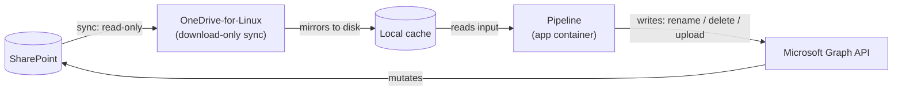
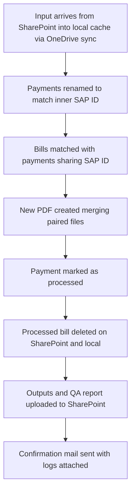

# Justifactu — Technical Documentation

## Contents

1. [Overview](#1-overview)
2. [Architecture](#2-architecture)
3. [Components](#3-components)
4. [Data flow](#4-data-flow)
5. [Identifiers & naming conventions](#5-identifiers--naming-conventions)
6. [Configuration](#6-configuration)
7. [Running it](#7-running-it)
8. [Testing](#8-testing)
9. [Known limitations](#9-known-limitations)
10. [Glossary](#10-glossary)

---

## 1. Overview

- Justifactu automates matching and merging bills (*facturas*) with their corresponding payments (*remeses*) stored in
  SharePoint. Payments are renamed to the SAP ID found in their PDF content; bills, already named with their SAP ID,
  are matched against that renamed set and combined into a single justification PDF per pair.

- The pipeline runs every few days, keeping the volume of unprocessed documents manageable between runs. It operates
  independently of Finances or any other department's systems or schedule.

- Justifactu replaces a manual, repetitive process that previously took significant time each month from the people
  responsible for these justifications. Automating the matching and merging leaves only the final review as manual
  work.

---

## 2. Architecture



- SharePoint serves as the only source of truth, and we use OneDrive-for-Linux to sync the relevant directories in
  download-only mode. This produces a local cache that serves as a temporal reference to do the main process. All of
  this runs in a Jenkins pipeline that manages the automation process, and it connects to various APIs throughout the
  run to do each step.

> [!IMPORTANT]
> Core design principle: local files are a disposable cache, and only SharePoint changes are durable.

- This automation has two main containers: `app` and `onedrive`.
  - `app` contains the installation of Justifactu itself. It's a one-shot script, meaning it doesn't run continuously.
  - `onedrive` is a long-running service that contains the sync process with SharePoint, and every 5 minutes mirrors
    the contents of the SharePoint directory and applies any changes. Since SharePoint is the source of truth of this
    whole project, this process is download-only to avoid local filesystem interference.

---

## 3. Components

| Area                       | Files                                   | Key functions                                                                                                                               | Responsibility                                                                                                                                                                                                                                                                                         |
|----------------------------|-----------------------------------------|---------------------------------------------------------------------------------------------------------------------------------------------|--------------------------------------------------------------------------------------------------------------------------------------------------------------------------------------------------------------------------------------------------------------------------------------------------------|
| **Ingestion & matching**   | `bills.py`, `payments.py`, `process.py` | `parse_bill_filename`, `parse_sap_id_from_bill`, `index_payments`, `rename_payments`, `merge_bills_and_payments`, `cleanup_processed_files` | Extracts the SAP ID from each side — from the bill's filename via regex, from the payment's PDF content via `pypdf` — matches bills to payments on that shared ID, drives the SharePoint-side payment rename, and after a successful merge marks the payment `_merged` and removes the processed bill. |
| **PDF generation**         | `pdf.py`                                | `merge_pdfs`                                                                                                                                | Combines a matched bill and payment into the single output PDF that gets uploaded to SharePoint.                                                                                                                                                                                                       |
| **SharePoint integration** | `sharepoint.py`, `token_manager.py`     | `rename_remote_item`, `delete_remote_item`, `upload_folder_recursive`, `download_folder_recursive`, `TokenManager.get_token`                | All Graph API calls — listing, downloading, uploading, renaming, and deleting remote items — plus the OAuth2 client-credentials token lifecycle that authenticates every one of those calls. This is the only place in the codebase that ever mutates SharePoint.                                      |
| **Secrets**                | `secret.py`, `vault.py`                 | `read_secret`, `_VaultClient`                                                                                                               | Resolves credentials through a fallback chain (mounted secret file → repo `secrets/` folder → environment variable → HashiCorp Vault via AppRole), so the same code runs unmodified in local dev and in the deployed containers.                                                                       |
| **Logging & QA reporting** | `logger.py`                             | `QAFilesFilter`, `setup_logging`                                                                                                            | Standard logging, plus a tagging mechanism (`extra={"qa_report": True}`) that lets any log call anywhere in the codebase mark itself as QA-report-worthy; a dedicated filtered handler collects only those into the separate QA report file.                                                           |
| **Mailing**                | `mail.py`                               | `send_mail`, `send_qa_report_mail`                                                                                                          | SMTP delivery (STARTTLS) of the end-of-run notification, with the QA report and full run log attached as files rather than pasted into the body.                                                                                                                                                       |
| **CLI / entry point**      | `arguments.py`, `main.py`               | `parse_arguments`, `main`                                                                                                                   | Defines the CLI surface (`--location`, `--input-location`, `--download-input`, `--download-subfolder`) and orchestrates the full run: connect to SharePoint, optionally force-download, rename payments, match and merge, clean up, upload outputs, send the notification mail.                        |

---

## 4. Data flow



---

## 5. Identifiers & naming conventions

- SAP ID: formed by the corresponding year and a 6-digit number. Bills are already named based on it, while payments
  receive theirs from their PDF content.

- File naming stages for payments:

  ```mermaid
  flowchart LR
      A[Original bank filename]
      B[sap_id-P]
      C[sap_id-P_merged]

      A -->|rename_payments| B
      B -->|cleanup_processed_files| C
  ```

- SharePoint folder layout:
  - `_input`, where all input files are. These files never
    - `FACTURES`, containing bills already properly named after their SAP ID.
    - `Remeses`, where the original payment files are and where they are renamed according to their SAP ID.
  - `_output`
    - `FACTURES+PAGAMENTS`
      - `2025_FACTURES+PAGAMENTS`
      - `2026_FACTURES+PAGAMENTS`
      - ...
    - `QA`

| Process                    | Output location                                                                 | Naming convention                           | Example                             |
|----------------------------|---------------------------------------------------------------------------------|---------------------------------------------|-------------------------------------|
| Payment file renaming      | `_output/Remeses`, original file location                                       | `(?P<year>20\d{2})(?P<sapid>\d{6})-P.pdf`   | `2025000458-P.pdf`                  |
| Fused bill and payment pdf | `_output/FACTURES+PAGAMENTS/(?P<year>20\{2})_FACTURA+PAGAMENT`                  | `(?P<year>20\d{2})(?P<sapid>\d{6})_F_P.pdf` | `2025000458_F_P.pdf`                |
| General log                | `_output/FACTURES+PAGAMENTS/sap.year + FolderName.YEAR_FOLDER_SUFFIX/QA_ERRORS` | `%Y-%m-%d_%H-%M-%S`                         | `2026-09-02_09-51-52.log`           |
| QA log                     | `_output/FACTURES+PAGAMENTS/sap.year + FolderName.YEAR_FOLDER_SUFFIX/QA_ERRORS` | `%Y-%m-%d_%H-%M-%S_qa_report`               | `2026-09-02_09-51-52_qa_report.log` |

### 5.1 Extracting the SAP ID from a bank payment PDF

Inside the payment PDF, the SAP ID sits next to a fixed marker: `Fra. <SAP ID>` (e.g. `Fra. 2025003695`). The parser
(`bills.py::parse_sap_id_from_bill`) looks for that marker with the regex `(Fra\.?\s+)` followed by a 4-digit year and
a 6-digit sequence — the period is optional and the whitespace is `\s+` (matches spaces *and* newlines), which is what
lets a single pattern cover both formats seen in practice:

| Bank source             | Marker as it appears in the PDF                                                   | Notes                                                                                                                                                               |
|-------------------------|-----------------------------------------------------------------------------------|---------------------------------------------------------------------------------------------------------------------------------------------------------------------|
| BBVA, before 27/04/2026 | `Fra. 2025003695` (period + space)                                                | Original format                                                                                                                                                     |
| BBVA, from 27/04/2026   | `Fra` on one line, `2025003695` on the next (no period, newline instead of space) | BBVA changed their statement layout; `\s+` already matches the newline and `\.?` already makes the period optional, so this format is covered without a code change |
| Sabadell                | `Fra. 2025000549` (period + space)                                                | Same format as BBVA's original                                                                                                                                      |

The resulting output naming (`{sap_id}-P.pdf`, hyphen not underscore) is already covered by the "Payment file renaming"
row in the table above.

### 5.2 Bill naming (Docuware)

Bills are downloaded from Docuware already named `F {sap_id}` (note the space after `F`) —
`bills.py::parse_bill_filename` matches that exact shape. Since 20/05/2025, bills entering Docuware get the SAP
document number written into the filename directly when the document is accounted for, replacing the older manual
process (scan the paper bill, split the PDF, name it by hand). Bills logged before that date were retroactively
renamed to the same convention as a one-off cleanup.

> [!NOTE]
> Downloading bills from Docuware is **not automated yet** — it's currently a manual, roughly-weekly step. Automating
> it (nightly, or timed to coincide with the bank payment download) is a planned follow-up, not yet scheduled.

### 5.3 Matching and merging

A bill (`F {sap_id}`) and a payment (`{sap_id}-P`) are matched purely on a shared SAP ID — `merge_bills_and_payments`
builds a payment map keyed by SAP ID and looks up each bill against it. When both exist, they're merged **bill first,
then payment** into the single fused PDF named per the "Fused bill and payment pdf" row above.

> [!NOTE]
> The original process description calls for deleting *both* source files after a successful merge — the bill and the
> bank payment PDF. The current implementation deletes the bill but only **renames** the payment (appending
> `_merged`) rather than deleting it, keeping it as a lightweight audit trail of which payment file produced which
> merge. Flagging this as a divergence from the original spec worth confirming is intentional, not an oversight.

> [!WARNING]
> The original process notes describe payments being consolidated into a distinct `_input/-stages/1/Pagaments` folder
> after renaming, before the merge step. That doesn't match the SharePoint folder layout documented above, where
> renaming happens in place under `Remeses` with no separate consolidation folder. Flagging the discrepancy rather
> than resolving it here — worth checking which one is current.

### 5.4 What doesn't get matched

A bill with no matching payment isn't necessarily an error — it likely belongs to a payment method handled outside
this flow: card payments, travel expenses, direct debits (*domiciliacions*), etc. Those go through a separate "own
treatment" process (Phase 3 — see `phase3_credit_cards.md`) rather than the bank-remittance matching described here.

---

## 6. Configuration

### Secrets

<table>
<tr><th>SharePoint</th><th>SMTP</th></tr>
<tr valign="top">
<td>

- `CLIENT_ID`
- `CLIENT_NAME`
- `CLIENT_SECRET`
- `OBJECT_ID`
- `SHAREPOINT_DOMAIN`
- `DRIVE_ID`
- `SITE_NAME`
- `TENANT_ID`

</td>
<td>

- `SMTP_PASSWORD`
- `SMTP_PORT`
- `SMTP_DEVELOPER_EMAIL`
- `SMTP_SERVER`
- `SMTP_USERNAME`
- `SMTP_ADMIN_EMAIL`
- `SMTP_OWNER_EMAIL`

</td>
</tr>
</table>

### `service/onedrive/conf/config`

This file controls how OneDrive-For-Linux behaves, what it syncs, how often, and how the local mirror is kept in line
with SharePoint. Its contents are the following:

| Setting               | Description                                                                                                                                                            |
|-----------------------|------------------------------------------------------------------------------------------------------------------------------------------------------------------------|
| `sync_dir`            | Container path the client writes the synced mirror into.                                                                                                               |
| `drive_id`            | Graph API identifier of the SharePoint directory being mirrored.                                                                                                       |
| `download_only`       | Setting that defines the rest of the architecture. Defines a one-way sync with SharePoint, and the local client will never push any change.                            |
| `cleanup_local_files` | Makes `download_only` mode also delete local files once their SharePoint counterpart has been deleted, in order to not accumulate orphaned copies.                     |
| `monitor_interval`    | How often, in seconds, the client tries to sync changes from SharePoint. It's currently set to 60, but this change is rejected by the client and defaults back to 300. |

> [!WARNING]
> `drive_id` has to match exactly the real drive — do not modify manually without care.

### `compose.yml`

It defines two services, which have healthchecks to ensure they are working properly, and with one dependency between them:

| Service    | Description                                                                                                                                                                                    |
|------------|------------------------------------------------------------------------------------------------------------------------------------------------------------------------------------------------|
| `app`      | Builds from the local `Dockerfile`, and won't start until `onedrive`'s healthcheck passes. It mounts the shared sync directory and applies `--input_location` pointing directly at that mount. |
| `onedrive` | Long-running service with three volumes (`conf`, `data`, and `logs`).                                                                                                                          |

---

## 7. Running it

### Local dev setup

1. Install dependencies:

   ```bash
   make install
   ```

2. Run the pipeline:

   ```bash
   make run CMD=""
   ```

> [!TIP]
> `make run` alone just prints `--help`, since `CMD` defaults to that — always override it explicitly.

### Common invocations

| Goal                                                                   | Command                                                                                      |
|------------------------------------------------------------------------|----------------------------------------------------------------------------------------------|
| Default run against SharePoint                                         | `make run CMD=""`                                                                            |
| Force a fresh download before processing (OneDrive sync fallen behind) | `make run CMD="--download-input"`                                                            |
| Download only a specific subfolder                                     | `make run CMD="--download-input --download-subfolder Remeses_prova"`                         |
| Run against local test data instead of SharePoint                      | `make run CMD="--location local --input-location ./service/onedrive/data/justifactu/_input"` |

---

## 8. Testing

- In order to run the test suite, simply run the command `make test` on console inside the environment.
- Instead of using remote calls, we use mock calls to the different services in order to do relevant tests, since
  local files are not the source of truth of the project. The objective of this testing strategy is to follow the
  architecture structure.

---

## 9. Known limitations

> [!CAUTION]
>
> - Bill deletion after merge is irreversible. Depending on future needs, we might move deleted items to the trash
>   instead of a direct deletion.
> - Local mirror lag relative to SharePoint. Since OneDrive-For-Linux takes minutes to read, check, and download new
>   content and erase the ones not mirrored in SharePoint, the process could incur some syncing lag. However, this
>   pipeline is designed to be run once every few days, so it should have ample time to sync before each full run.
> - No network timeouts on HTTP calls yet.
> - Bill ingestion from Docuware is still a manual, weekly step (see [§5.2](#52-bill-naming-docuware)) — not yet part
>   of the automated pipeline.
---

## 10. Glossary

| Term                        | Definition                                                                                                                                                                                                                                    |
|-----------------------------|-----------------------------------------------------------------------------------------------------------------------------------------------------------------------------------------------------------------------------------------------|
| **Factura**                 | A bill. It's a PDF document containing an individual bill assigned to a specific transaction. It comes with its SAP ID already put in the name, and is located in the `FACTURES` folder in the SharePoint folder structure.                   |
| **Remesa**                  | A batch of payments. Each remesa contains an amount of payments, sorted by bank and month of the year. They are named initially by the bank that expedites them.                                                                              |
| **Justificar**              | To justify. The act of assigning the appropriate bill to each payment, thus justifying each expense with an external document.                                                                                                                |
| **SAP ID**                  | The unique identification number assigned to each entry on the SAP platform. It is the indicator that correlates each bill with its payment.                                                                                                  |
| **QA report**               | Document generated at the end of each run that contains all the information on the documents that didn't pass correctly through the pipeline, be it either a wrongly-named bill or a payment without a correct SAP ID inside, amongst others. |
| **Remote**                  | That which happens outside the current physical system, such as external services like SharePoint or the mailing API connection.                                                                                                              |
| **Local**                   | That which happens on the current physical system, like the main execution and the Docker containers that host the downloaded data from SharePoint.                                                                                           |
| **Docuware**                | The external document-management system bills are downloaded from. Currently a manual step (§5.2); not yet wired into the automated pipeline.                                                                                                 |
| **Own treatment / Phase 3** | The separate process for payments that don't match a bill in this flow — card payments, travel expenses, direct debits (*domiciliacions*). Documented in `phase3_credit_cards.md`.                                                            |